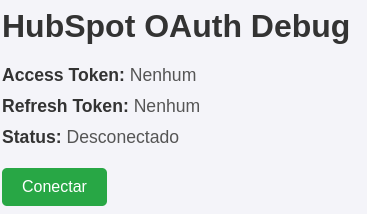
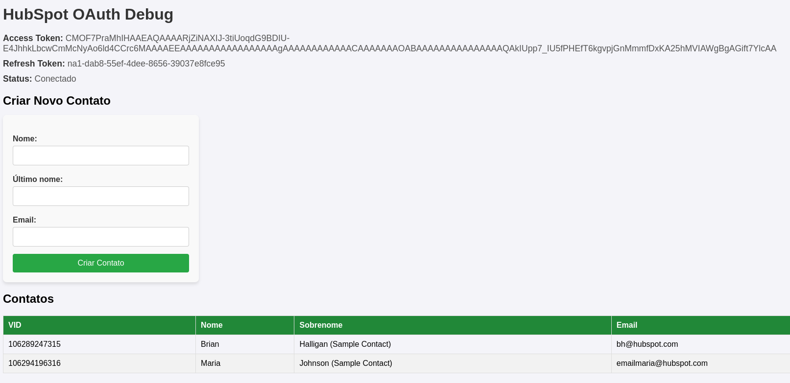

# Projeto HubSpot OAuth Debug

Este projeto é uma aplicação Spring para integração com a API do HubSpot, usando OAuth.
- [README TECH](./README_TECH.md) - Detalhes técnicos sobre o projeto.
## Requisitos

Antes de rodar a aplicação, você precisará das seguintes ferramentas:

- **Java 17+**: A aplicação usa o Spring Framework, que requer o Java 17 ou superior.
- **ASDF (Opcional)**: Gerenciador de versões de ferramentas para gerenciar versões de Java. Apenas pra facilitar instalação de várias versões java na máquina.
- **ngrok**: Usado para expor a aplicação local para a web, para parametrização do webhook.

#### Rode a aplicação seguindo a etapa 1 ou 2.

## 1. Rodando local


### 1.1 Instalando o ASDF (Opcional)

Se você ainda não tiver o ASDF instalado, siga as instruções abaixo:

- [Instruções de instalação do ASDF](https://asdf-vm.com/#/core-manage-asdf-vm)

### 1.2 Instalando as versões de ferramentas necessárias  (Opcional)

Com o ASDF instalado, use os seguintes comandos para instalar as versões de Java e Node.js que a aplicação precisa:

```bash

# Instalando asdf plugin Java
asdf plugin-add java

# Rodando dentro da pasta do projeto
asdf install
```
### 1.3 Instalar ngrok
[Instruções de instalação do ngrok, siga o Step 1](https://ngrok.com/docs/getting-started/)


### 1.4. Adicione o token do ngrok
```bash

ngrok config add-authtoken 2uVoxr4hwv8UFtnRedsVnJrxCok_7Ace8kwPTrH3bCNsjksGq
```


### 1.5 Rode o ngRok
```bash

ngrok http --url=alive-hardly-flamingo.ngrok-free.app 8080
```
### 1.6 Rode a aplicação
```bash

./gradlew bootRun
```

## 2. Rodando pelo docker-compose
[Instruções de instalação docker-compose](https://docs.docker.com/compose/install/)
```bash

#Na raiz do projeto
sudo docker-compose up
```

## 3. Acesso
Acesse aplicação a partir de https://alive-hardly-flamingo.ngrok-free.app
### 3.1 Tela esperada


### 3.2 Tela autenticada


